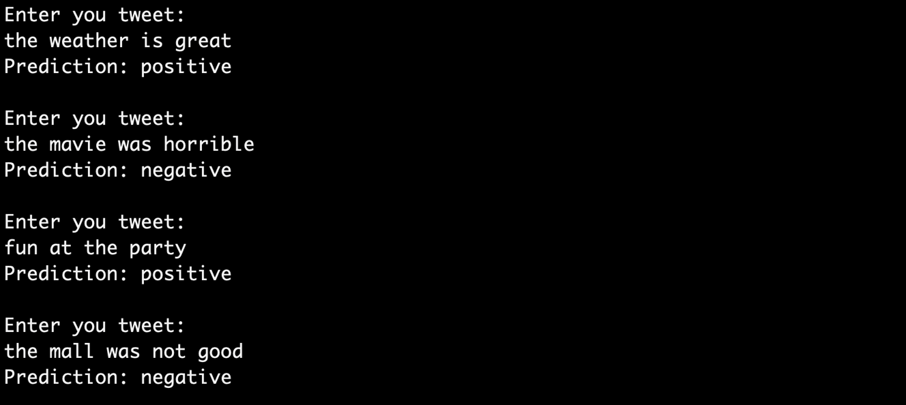

# naive_bayes_sentiment
Sentiment Analysis (words) (twitter)

Sentimental Analysis forms the basis of semantic science that aids in drawing out opinions 
expressed in different forms of media such as the attitude towards a piece of content or a product.

IMPLEMENTATION OF a robust and an optimal solution to analyse the sentiment quotient of a sentence 
BASED ON THE NAIVE-BAYES ALGORITHM.

IMPLEMENTED ALGORITHM :
- FILE FETCH FOR TRAINING DATA
- CREATE A 2D SPARSE MATRIX EACH OF WHOSE COLUMNS CONTAIN WORD FREQUENCIES OF A PARTICULAR TRAINING SAMPLE 
- MEAN AND STANDARD DEVIATION OF EACH ROW OF THE SPARSE MATRIX IS CALCULATED SEPARATELY FOR POSITIVE AND NEGATIVE DATA
- EACH TEST INPUT IS CONVERTED INTO COLUMN MATRIX WHOSE VALUES ALONG WITH THE MEAN AND STANDARD DEVIATION OF THE TEST 
  DATA IS USED TO CALCULATE THE PROBABILITY OF THE TEST DATA BEING POSITIVE OR NEGATIVE
  
SAMPLE RUN :

  
  
